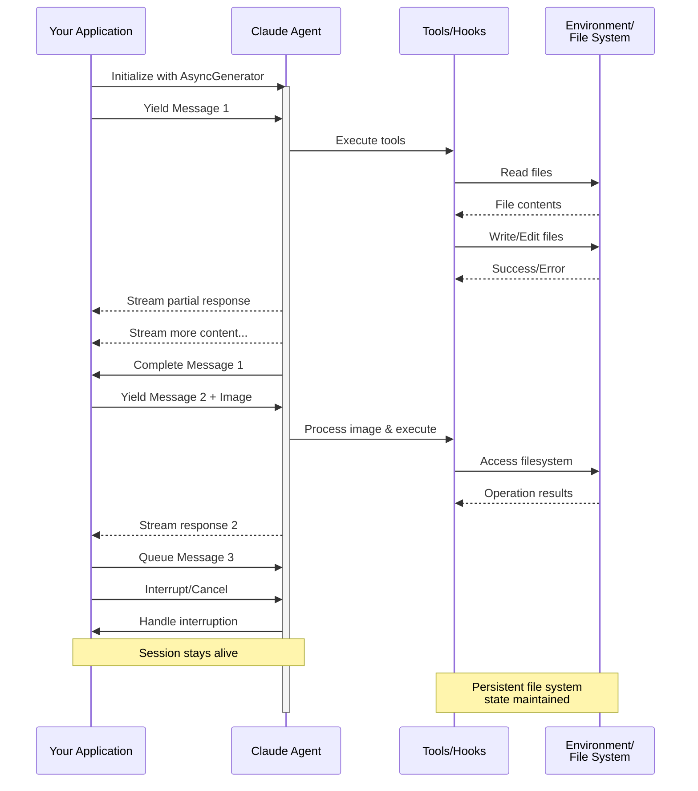

# 流式输入

理解 Claude Agent SDK 的两种输入模式及何时使用每种模式

---

## 概述

Claude Agent SDK 支持两种不同的输入模式来与代理交互：

- **流式输入模式**（默认和推荐）- 一个持久的、交互式的会话
- **单消息输入** - 使用会话状态和恢复的一次性查询

本指南解释了每种模式的差异、优势和用例，以帮助您为应用程序选择正确的方法。

## 流式输入模式（推荐）

流式输入模式是使用 Claude Agent SDK 的**首选**方式。它提供对代理功能的完全访问，并支持丰富的交互式体验。

它允许代理作为一个长期运行的进程运行，接收用户输入、处理中断、显示权限请求并处理会话管理。

### 工作原理



### 优势

<CardGroup cols={2}>
  <Card title="图像上传" icon="image">
    直接将图像附加到消息中以进行视觉分析和理解
  </Card>
  <Card title="队列消息" icon="stack">
    发送多条按顺序处理的消息，具有中断能力
  </Card>
  <Card title="工具集成" icon="wrench">
    在会话期间完全访问所有工具和自定义 MCP 服务器
  </Card>
  <Card title="钩子支持" icon="link">
    使用生命周期钩子在各个点自定义行为
  </Card>
  <Card title="实时反馈" icon="lightning">
    查看生成的响应，而不仅仅是最终结果
  </Card>
  <Card title="上下文持久性" icon="database">
    自然地在多个回合中保持对话上下文
  </Card>
</CardGroup>

### 实现示例

<CodeGroup>

```typescript TypeScript
import { query } from "@anthropic-ai/claude-agent-sdk";
import { readFileSync } from "fs";

async function* generateMessages() {
  // First message
  yield {
    type: "user" as const,
    message: {
      role: "user" as const,
      content: "Analyze this codebase for security issues"
    }
  };
  
  // Wait for conditions or user input
  await new Promise(resolve => setTimeout(resolve, 2000));
  
  // Follow-up with image
  yield {
    type: "user" as const,
    message: {
      role: "user" as const,
      content: [
        {
          type: "text",
          text: "Review this architecture diagram"
        },
        {
          type: "image",
          source: {
            type: "base64",
            media_type: "image/png",
            data: readFileSync("diagram.png", "base64")
          }
        }
      ]
    }
  };
}

// Process streaming responses
for await (const message of query({
  prompt: generateMessages(),
  options: {
    maxTurns: 10,
    allowedTools: ["Read", "Grep"]
  }
})) {
  if (message.type === "result") {
    console.log(message.result);
  }
}
```

```python Python
from claude_agent_sdk import ClaudeSDKClient, ClaudeAgentOptions, AssistantMessage, TextBlock
import asyncio
import base64

async def streaming_analysis():
    async def message_generator():
        # First message
        yield {
            "type": "user",
            "message": {
                "role": "user",
                "content": "Analyze this codebase for security issues"
            }
        }

        # Wait for conditions
        await asyncio.sleep(2)

        # Follow-up with image
        with open("diagram.png", "rb") as f:
            image_data = base64.b64encode(f.read()).decode()

        yield {
            "type": "user",
            "message": {
                "role": "user",
                "content": [
                    {
                        "type": "text",
                        "text": "Review this architecture diagram"
                    },
                    {
                        "type": "image",
                        "source": {
                            "type": "base64",
                            "media_type": "image/png",
                            "data": image_data
                        }
                    }
                ]
            }
        }

    # Use ClaudeSDKClient for streaming input
    options = ClaudeAgentOptions(
        max_turns=10,
        allowed_tools=["Read", "Grep"]
    )

    async with ClaudeSDKClient(options) as client:
        # Send streaming input
        await client.query(message_generator())

        # Process responses
        async for message in client.receive_response():
            if isinstance(message, AssistantMessage):
                for block in message.content:
                    if isinstance(block, TextBlock):
                        print(block.text)

asyncio.run(streaming_analysis())
```

</CodeGroup>

## 单消息输入

单消息输入更简单但功能更受限。

### 何时使用单消息输入

在以下情况下使用单消息输入：

- 您需要一次性响应
- 您不需要图像附件、钩子等
- 您需要在无状态环境中运行，例如 lambda 函数

### 限制

<Warning>
单消息输入模式**不**支持：
- 消息中的直接图像附件
- 动态消息队列
- 实时中断
- 钩子集成
- 自然的多轮对话
</Warning>

### 实现示例

<CodeGroup>

```typescript TypeScript
import { query } from "@anthropic-ai/claude-agent-sdk";

// Simple one-shot query
for await (const message of query({
  prompt: "Explain the authentication flow",
  options: {
    maxTurns: 1,
    allowedTools: ["Read", "Grep"]
  }
})) {
  if (message.type === "result") {
    console.log(message.result);
  }
}

// Continue conversation with session management
for await (const message of query({
  prompt: "Now explain the authorization process",
  options: {
    continue: true,
    maxTurns: 1
  }
})) {
  if (message.type === "result") {
    console.log(message.result);
  }
}
```

```python Python
from claude_agent_sdk import query, ClaudeAgentOptions, ResultMessage
import asyncio

async def single_message_example():
    # Simple one-shot query using query() function
    async for message in query(
        prompt="Explain the authentication flow",
        options=ClaudeAgentOptions(
            max_turns=1,
            allowed_tools=["Read", "Grep"]
        )
    ):
        if isinstance(message, ResultMessage):
            print(message.result)

    # Continue conversation with session management
    async for message in query(
        prompt="Now explain the authorization process",
        options=ClaudeAgentOptions(
            continue_conversation=True,
            max_turns=1
        )
    ):
        if isinstance(message, ResultMessage):
            print(message.result)

asyncio.run(single_message_example())
```

</CodeGroup>