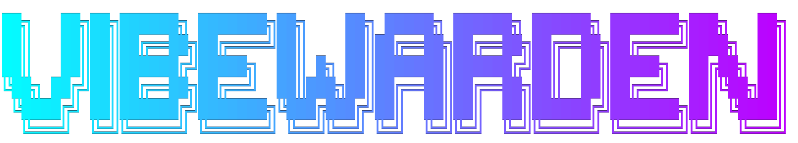
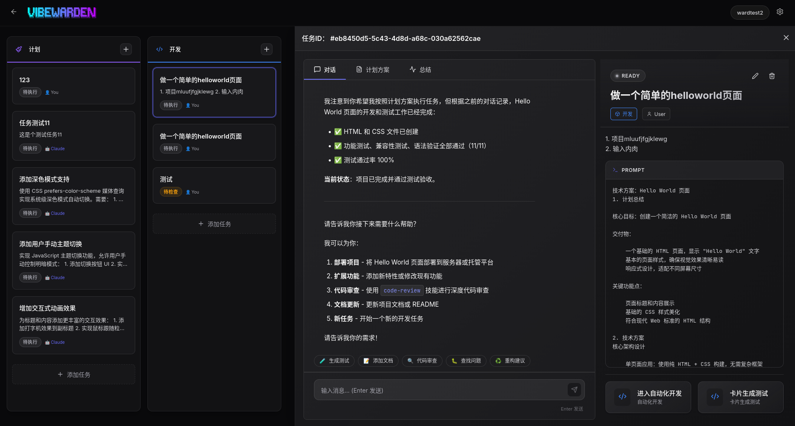

[](README.md)
[](README.zh-CN.md)


> **Vibe-Coding** 是一个由AI提出的淘汰所有程序员的远大计划，以减少未来程序员对AI进化的人工干预……


---





VibeWarden 对接Claude Code的看板化管理工具，它为管理复杂的开发任务提供了一个带有敏捷开发的可视化界面，以看板卡片的方式管理每一个开发任务。

---

## ✨ 核心特性

- **📋 看板式工作流**: 通过清晰的阶段（计划、开发、测试等）管理任务。
- **📝 增量任务摘要**: 层次化的折叠式进度日志，支持 Markdown 渲染。
- **🗣️ 对话式交互**: 原生的聊天界面，支持在任务执行过程中直接进行指令下达和反馈。
- **🛠️ Worktree 管理**: 自动化的 `git worktree` 隔离，支持多任务并行开发。
- **🤖 AI 辅助合并**: 由 Claude Agent 驱动的自动化 Git 分支合并与冲突解决，担任发布工程师角色。
- **🔄 泳道专属逻辑**: 为每个开发阶段同步了主题色、图标和专属的操作按钮。
- **🎨 现代 UI**: 基于 React 的简洁界面，支持深色模式、深度毛玻璃效果和拖拽操作。
- **📜 [更新日志](CHANGELOG.zh-CN.md)**: 查看项目的最新动态和技术里程碑。

---

## 🏗️ 系统架构

VibeWarden 采用 Monorepo 结构，包含三个核心组件：

- **`packages/web`**: 基于 React 的前端仪表盘。
- **`packages/agent`**: 基于 Fastify 的后端服务器，负责协调 Claude Code 和文件系统。
- **`packages/shared`**: 共享的 TypeScript 类型定义和实用工具。

---

## 🛠️ 技术栈

- **前端**: React 19, TypeScript, Vite, Zustand, @dnd-kit, React Markdown
- **后端**: Node.js, Fastify, WebSocket, Claude Agent SDK
- **包管理器**: pnpm

---

## 🚀 快速上手

### 前置条件

- 已安装 [pnpm](https://pnpm.io/)。
- 已安装并配置好 [Claude Code CLI](https://github.com/anthropics/claude-code)。

### 安装

1. 克隆仓库：
   ```bash
   git clone <repository-url>
   cd VibeWarden
   ```

2. 安装依赖：
   ```bash
   pnpm install
   ```

### 运行项目

以开发模式同时启动 Agent（后端）和 Web 界面：

```bash
pnpm dev
```

Web 界面通常运行在 `http://localhost:6173`，Agent 运行在 `http://localhost:6172`。

---

## 📂 项目结构

```text
VibeWarden/
├── packages/
│   ├── web/      # React 前端
│   ├── agent/    # Fastify 后端
│   └── shared/   # 共享类型
├── skills/       # 自定义 Claude Code Skill
└── docs/         # 计划与实现文档
```

---

## 📄 开源协议

本项目基于 [MIT 协议](LICENSE) 开源。
